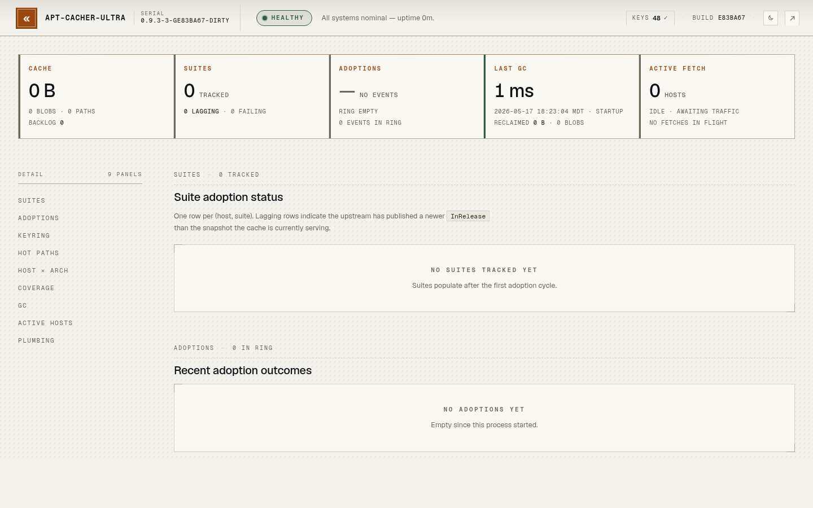

# apt-cacher-ultra

A robust apt repository cache focused on availability under upstream failure.

Designed as a replacement for `apt-cacher-ng` that keeps cache hits fast and
successful even when upstream Ubuntu/Debian/PPA mirrors are slow, broken, or
under DDoS.

> **Contributing:** apt-cacher-ultra accepts AI-authored contributions only.
> See [CONTRIBUTING.md](CONTRIBUTING.md) for more details.



## Status

Functionality is complete.  I have it running in all my environments and am
just letting it "soak" to see if there are any long-term issues.  There are some
"stretch goals" I might consider adding, but they are largely "polishing brass".
I have not done any multi-arch testing.  Will consider a 1.0 release in June if
no issues crop up during my soak.

## Features

- Drop-in apt-cacher-ng replacement — same :3142 port, proxy mode, and http://HTTPS/// URL convention, so existing
client configs work unchanged.
- Availability-first caching — cache hits never block on upstream; stale metadata is served when upstream is down/slow
  rather than failing.
- Atomic snapshot adoption — per-suite InRelease + all referenced Packages/by-hash blobs are staged, GPG-verified, and
  flipped in a single SQLite transaction so clients always see a coherent metadata set.
- Bundled trust anchors — canonical Ubuntu, Debian, and Ubuntu Pro ESM archive keys ship inside the binary, so stock
  repositories verify out of the box even on minimal hosts. The host keyring (`/etc/apt/trusted.gpg.d`,
  `/etc/apt/keyrings`, plus any `adoption.keyring_dirs`) layers on top and takes precedence on fingerprint collision;
  the admin status page lists every loaded key with its source.
- TLS MITM (optional) — local CA signs per-host leaf certs so HTTPS repos (e.g. download.docker.com) can be cached,
- Hash validation — every metadata file is checked against InRelease, every .deb against Packages; mismatches are
rejected.
- by-hash dedup — indices stored by content hash, deduplicated across suites.
- Singleflight coalescing — N concurrent clients requesting the same uncached file produce one upstream fetch.
- Resumable upstream fetches — HTTP Range used to resume on transient failure.
gated by an allowed-host regex.
- Freshness control — periodic and on-request InRelease checks with cooldown; hot-package proactive refresh.
- Concurrency caps — per-host and global max_concurrent_adoptions semaphores keep adoption traffic from starving
request-path callers.
- Garbage collection — refcounted blobs are swept when no snapshot references them.
- Observability — /metrics endpoint, status page, structured logs (see docs/log-fields.md).
- Packaging — ships as a .deb with systemd unit, or as standalone go executable.

## Quickstart

### As Deb Package:

```sh
make deb
dpkg -i build/apt-cacher-ultra_*.deb
#  EDIT: /etc/apt-cacher-ultra/config.toml
sudo systemctl enable --now apt-cacher-ultra
systemctl start apt-cacher-ultra
#  allow 3142 through firewall if necessary:
iptables -I INPUT -p tcp --dport 3142 -j ACCEPT
```
### Manual build:

```sh
make build
cp packaging/config/config.toml.default config.toml
#  EDIT: config.toml
./build/apt-cacher-ultra -config config.toml
```

### Configure apt clients:

Point clients at it as a proxy (matches existing apt-cacher-ng deployments)
by creating the following file with these contents:

```
# /etc/apt/apt.conf.d/00aptcacher
Acquire::http::Proxy "http://[APT_CACHER_ULTRA_HOSTNAME:3142";
```

For apt repositories using https, you have these choices:

- Make no changes, but apt-cacher-ultra does not cache the associated packages
- Set up an MITM proxy (see the next section).
- Replace `https://` with `http://HTTPS///` in the sources.list entry, **or** set up MITM proxy.

### Enable the MITM HTTPS proxy (optional):

By default `CONNECT` for `https://` repos returns `405` — apt then talks
TLS straight to the upstream and the cache is bypassed for those repos.
Enabling MITM lets the cache decrypt, cache, and re-serve HTTPS sources
by signing per-host leaf certs from a local CA.

1. Add a `[tls_mitm]` block to `config.toml`:

   ```toml
   [tls_mitm]
   enabled            = true
   # allowed_host_regex narrows which upstream hosts MITM will sign for.
   # If left empty, set allow_unconstrained_ca = true (not recommended).
   allowed_host_regex = '^([a-z0-9-]+\.)*(ubuntu\.com|debian\.org)$|^download\.docker\.com$'
   # ca_cert / ca_key empty = auto-generate under <cache.dir>/ca on first start.
   ```

2. Start the daemon once so the CA is materialized, then export it:

   ```sh
   sudo systemctl restart apt-cacher-ultra
   sudo apt-cacher-ultra ca print > apt-cacher-ultra-ca.crt
   ```

3. Set up the CA key on every apt client. Choose one of:

   a. Install the CA and refresh the system-wide trust store:

      ```sh
      sudo cp apt-cacher-ultra-ca.crt /usr/local/share/ca-certificates/
      sudo update-ca-certificates
      ```

   b. Place the CA cert and configure apt (and only apt) to use it:

      ```sh
      sudo cp apt-cacher-ultra-ca.crt /etc/ssl/certs/
      ```

      Then in an `/etc/apt/apt.conf.d` file:

      ```
      # /etc/apt/apt.conf.d/00aptcacher
      Acquire::http::Proxy "http://[APT_CACHER_ULTRA_HOSTNAME:3142";
      Acquire::https::CaInfo "/etc/ssl/certs/apt-cacher-ultra-ca.crt";
      ```

4. Generate the client apt-conf snippet (includes the CA fingerprint as
   a comment for verification):

   ```sh
   apt-cacher-ultra --print-apt-conf -config /etc/apt-cacher-ultra/config.toml \
       > /etc/apt/apt.conf.d/00aptcacher
   ```

## Inspecting the cache

Two read-only management subcommands let you see what's in the blob store
and pull a specific `.deb` back out without touching the daemon. Both
run safely while the daemon is live (SQLite WAL allows concurrent
readers).

```sh
# List every cached .deb (NAME / SIZE / AGE / HOST(S))
apt-cacher-ultra packages list -config /etc/apt-cacher-ultra/config.toml

# Filter by substring against the .deb filename
apt-cacher-ultra packages list -config /etc/apt-cacher-ultra/config.toml nginx

# Alternate output formats
apt-cacher-ultra packages list -format plain   # one filename per line
apt-cacher-ultra packages list -format json    # JSON array

# Copy a specific .deb out of the pool by exact filename.
# Destination may be a directory (file is named after the .deb) or a path.
apt-cacher-ultra packages copy -config /etc/apt-cacher-ultra/config.toml \
    nginx_1.18.0-1_amd64.deb /tmp/
```

## Build

```sh
make build           # binary at ./build/apt-cacher-ultra
make test            # unit tests
make lint            # golangci-lint (must be installed)
make deb             # .deb package (nfpm must be installed)
make clean
```

## License

Released into the public domain under [CC0 1.0 Universal](LICENSE).

