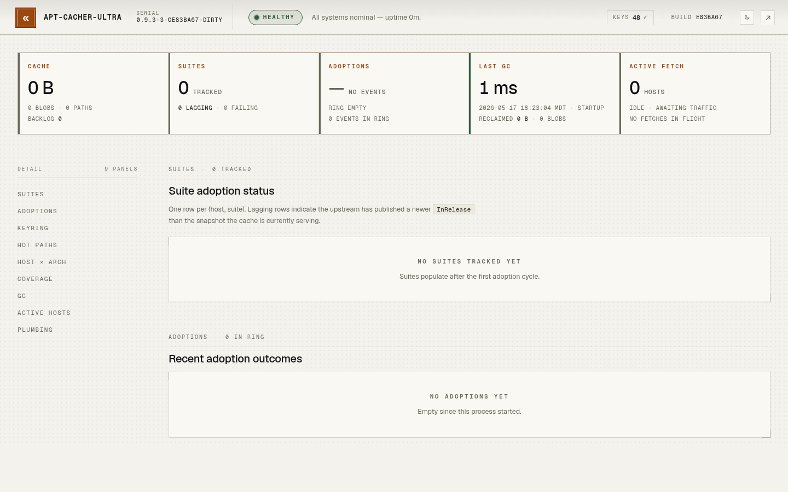

# apt-cacher-ultra

A robust apt repository cache focused on availability under upstream failure.

Designed as a replacement for `apt-cacher-ng` that keeps cache hits
available even when upstream Ubuntu/Debian/PPA mirrors are slow, broken,
or under DDoS.  It snapshots repo updates, tracks "hot packages" across your
fleet, and pre-downloads hot packages before making snapshot updates available
for clients to request.  This provides the ability to reliably provide package
sets to clients even if upstream servers become unavailable.  The limitation is
that "cold" packages require upstream availability.  Typical usage should be
available from the cache at all times.

> **Contributing:** apt-cacher-ultra accepts AI-authored contributions only.
> See [CONTRIBUTING.md](CONTRIBUTING.md) for more details.



## Status

Stable 1.0 release.  I run it in my 4 environments with 200 machines, serving thousands
of "apt update/upgrade" and "apt installs".

## Features

- Drop-in apt-cacher-ng replacement — same :3142 port, proxy mode, and http://HTTPS/// URL convention, so existing
client configs work unchanged.
- TLS MITM (optional) — local CA signs per-host leaf certs so HTTPS repos (e.g. download.docker.com) can be cached,
- Availability-first caching — cache hits never block on upstream; snapshot is served when upstream is down/slow
  rather than failing.
- Atomic snapshot adoption — per-suite InRelease + all referenced Packages/by-hash blobs are staged, GPG-verified, and
  flipped in a single SQLite transaction so clients always see a coherent metadata set.
- Hash validation — every metadata file is checked against InRelease, every .deb against Packages; mismatches are
rejected.
- by-hash dedup — indices stored by content hash, deduplicated across suites.
- Singleflight coalescing — N concurrent clients requesting the same uncached file produce one upstream fetch.
- Resumable upstream fetches — HTTP Range used to resume on transient failure.
gated by an allowed-host regex.
- Freshness control — periodic and on-request InRelease checks with cooldown; hot-package proactive refresh.
- Concurrency caps — per-host and global max_concurrent_adoptions semaphores keep adoption traffic from starving
request-path callers.
- Garbage collection — refcounted blobs are swept when no snapshot references them.
- Self-healing snapshots — a snapshot adopted while a required index was briefly unavailable is repaired in place,
  automatically on the next unchanged freshness check or on demand via `POST /reconcile` (see "Recovering a degraded
  repository").
- Observability — /metrics endpoint, status page, structured logs (see docs/log-fields.md).
- Packaging — install from the [apt repository](https://linsomniac.github.io/apt-cacher-ultra/), the `.deb` with systemd unit, or the standalone Go executable.

## Quickstart

### Install from the apt repository (recommended):

```sh
sudo install -d -m0755 /etc/apt/keyrings
curl -fsSL https://linsomniac.github.io/apt-cacher-ultra/apt-cacher-ultra.gpg \
  | sudo tee /etc/apt/keyrings/apt-cacher-ultra.gpg >/dev/null
sudo chmod a+r /etc/apt/keyrings/apt-cacher-ultra.gpg  # apt verifies as the _apt user; the key must be world-readable
echo 'deb [signed-by=/etc/apt/keyrings/apt-cacher-ultra.gpg] https://linsomniac.github.io/apt-cacher-ultra/ stable main' \
  | sudo tee /etc/apt/sources.list.d/apt-cacher-ultra.list
sudo apt-get update
sudo apt-get install apt-cacher-ultra
#  EDIT: /etc/apt-cacher-ultra/config.toml
sudo systemctl enable --now apt-cacher-ultra
```

Prebuilt `amd64` packages are published to
<https://linsomniac.github.io/apt-cacher-ultra/> (newest stable releases).

### As Deb Package:

```sh
make deb
dpkg -i build/apt-cacher-ultra_*.deb
#  EDIT: /etc/apt-cacher-ultra/config.toml
sudo systemctl enable --now apt-cacher-ultra
systemctl start apt-cacher-ultra
#  allow 3142 through firewall if necessary:
iptables -I INPUT -p tcp --dport 3142 -j ACCEPT
```
### Manual build:

```sh
make build
cp packaging/config/config.toml.default config.toml
#  EDIT: config.toml
./build/apt-cacher-ultra -config config.toml
```

## Configuration

Edit `/etc/apt-cacher-ultra/config.toml` (or the file passed to `-config`),
then restart the daemon. The [configuration reference](docs/configuration.md)
documents every option, its defaults, valid values, and interactions. The
[packaged example](packaging/config/config.toml.default) includes every option
with concise comments and optional signer, remap, and mirror examples.

The packaged configuration listens on `0.0.0.0:3142`, allows all upstreams,
and enables HTTPS MITM;
[HTTPS proxy clients must trust the cache's CA](#configure-the-mitm-https-proxy-optional).
Snapshot adoption is initially disabled. The admin interface, including
`POST /reconcile`, listens on `127.0.0.1:6789`. Review these settings before
making either listener available beyond your trusted network.

To fetch through another proxy, set `proxy = "http://proxy.example.net:3128"`
in `[upstream]`. Direct access remains the default. See
[upstream proxy setup](docs/configuration.md#using-an-upstream-proxy) for
authentication, HTTPS, and access-policy requirements.

For maintainers, [documentation publishing options](docs/documentation-hosting.md)
compares hosting the docs alongside the apt repository, on a separate Pages
site, or on an existing server.

### Configure apt clients:

Point clients at it as a proxy (matches existing apt-cacher-ng deployments)
by creating the following file with these contents:

```
# /etc/apt/apt.conf.d/00aptcacher
Acquire::http::Proxy "http://APT_CACHER_ULTRA_HOSTNAME:3142";
Acquire::https::Proxy "DIRECT";
```

The explicit `DIRECT` keeps HTTPS uncached until you configure MITM below.
APT inherits HTTP options for HTTPS when their HTTPS counterparts are unset;
see [APT HTTPS options](https://manpages.debian.org/unstable/apt/apt-transport-https.1.en.html#OPTIONS).

For apt repositories using **https**, pick one of these (the cache allows all
upstream hosts by default, so no allowlist editing is needed):

- **https, not cached** — leave the sources as `https://` and set
  `Acquire::https::Proxy "DIRECT";`. apt connects directly to the upstream
  over TLS. Pointing HTTPS at the cache while MITM is off produces a `405`
  response to `CONNECT` and apt fails.
- **https, cached, no MITM** — rewrite each source from `https://HOST/path`
  to `http://HTTPS///HOST/path` (the apt-cacher-ng convention). The
  client↔cache hop is plain http through the proxy above; the cache fetches
  the upstream over https and caches the result. No CA setup required.
- **https, cached, with MITM** — keep the sources as `https://`, configure
  the MITM proxy, and install its CA on each client (see the next section).

### Configure the MITM HTTPS proxy (optional):

MITM is enabled by default. It decrypts, caches, and re-serves HTTPS sources
by signing per-host leaf certificates from a local CA. Clients using
`Acquire::https::Proxy` must trust that CA. Setting `tls_mitm.enabled = false`
rejects `CONNECT` with `405`; apt does not automatically fall back to a direct
connection. To access HTTPS repositories directly, explicitly set
`Acquire::https::Proxy "DIRECT";`.

1. Edit the existing `[tls_mitm]` block in `config.toml` (add it if absent):

   ```toml
   [tls_mitm]
   enabled            = true
   # allowed_host_regex lists the hosts MITM may sign certs for. It is
   # translated into the CA's X.509 NameConstraints, so it accepts only a
   # restricted grammar (see the table below). This example covers the
   # Debian repos plus Docker:
   allowed_host_regex = '^(deb\.debian\.org|security\.debian\.org|download\.docker\.com)$'
   allow_unconstrained_ca = false
   # ca_cert / ca_key empty = auto-generate under <cache.dir>/ca on first start.
   ```

   **Supported `allowed_host_regex` shapes** (anchors `^…$` optional but must
   be balanced). When generating a new CA, anything else is refused with
   `mitm_ca_unconstrained_refused` if `allow_unconstrained_ca = false`:

   | Shape | Example |
   |-------|---------|
   | literal host | `^deb\.debian\.org$` |
   | single-label prefix (note `+`, not `*`) | `^[a-z0-9-]+\.debian\.org$` |
   | optional 2-letter region | `^([a-z]{2}\.)?archive\.ubuntu\.com$` |
   | alternation of **literal** hosts | `^(deb\.debian\.org\|security\.debian\.org)$` |

   `*` quantifiers and alternations with non-literal branches (e.g. the
   `^([a-z0-9-]+\.)*(ubuntu\.com|debian\.org)$` form) are **not** supported.
   To MITM-sign for **all** hosts instead (no name constraints — convenient,
   but the CA can then mint a cert for any name), use:

   ```toml
   [tls_mitm]
   enabled                = true
   allowed_host_regex     = ''
   allow_unconstrained_ca = true
   ```

   These generation settings apply when creating a CA. An existing CA is
   reused; changing the regex does not replace its name constraints. See
   [CA reuse and policy changes](docs/configuration.md#ca-reuse-and-policy-changes).

2. Start the daemon once so the CA is materialized, then export it:

   ```sh
   sudo systemctl restart apt-cacher-ultra
   sudo apt-cacher-ultra ca print > apt-cacher-ultra-ca.crt
   ```

3. Install the CA **certificate** on every apt client; keep the private key
   on the cache host. Choose one of:

   a. Install the CA and refresh the system-wide trust store:

      ```sh
      sudo cp apt-cacher-ultra-ca.crt /usr/local/share/ca-certificates/
      sudo update-ca-certificates
      ```

   b. Place the CA cert and configure apt (and only apt) to use it:

      ```sh
      sudo cp apt-cacher-ultra-ca.crt /etc/ssl/certs/
      ```

      Then in an `/etc/apt/apt.conf.d` file:

      ```
      # /etc/apt/apt.conf.d/00aptcacher
      Acquire::http::Proxy "http://APT_CACHER_ULTRA_HOSTNAME:3142";
      Acquire::https::Proxy "http://APT_CACHER_ULTRA_HOSTNAME:3142";
      Acquire::https::CaInfo "/etc/ssl/certs/apt-cacher-ultra-ca.crt";
      ```

4. Set `cache.advertise_host` to the cache's client-facing hostname or
   host:port if `cache.listen` uses a wildcard address such as `0.0.0.0`.
   Generate the client apt-conf snippet (includes both proxy settings and
   the CA fingerprint as a comment for verification):

   ```sh
   # Run on the cache host:
   sudo apt-cacher-ultra --print-apt-conf -config /etc/apt-cacher-ultra/config.toml \
       > 00aptcacher.generated
   ```

   Copy the generated file to each client, then install it there with
   `sudo install -m 0644 00aptcacher.generated /etc/apt/apt.conf.d/00aptcacher`.
   If using apt-only CA trust from step 3b, retain the
   `Acquire::https::CaInfo` line when installing the generated snippet.
   `--print-apt-conf` emits an HTTPS proxy line even when MITM is disabled;
   use it for this MITM setup, or replace its HTTPS proxy value with `DIRECT`
   for HTTP-only caching.

## Inspecting the cache

Two read-only management subcommands let you see what's in the blob store
and pull a specific `.deb` back out without touching the daemon. Both
run safely while the daemon is live (SQLite WAL allows concurrent
readers).

```sh
# List every cached .deb (NAME / SIZE / AGE / HOST(S))
apt-cacher-ultra packages list -config /etc/apt-cacher-ultra/config.toml

# Filter by substring against the .deb filename
apt-cacher-ultra packages list -config /etc/apt-cacher-ultra/config.toml nginx

# Alternate output formats
apt-cacher-ultra packages list -format plain   # one filename per line
apt-cacher-ultra packages list -format json    # JSON array

# Copy a specific .deb out of the pool by exact filename.
# Destination may be a directory (file is named after the .deb) or a path.
apt-cacher-ultra packages copy -config /etc/apt-cacher-ultra/config.toml \
    nginx_1.18.0-1_amd64.deb /tmp/
```

## Recovering a degraded repository

If a suite was adopted while a required index was briefly unavailable upstream,
its snapshot can end up missing that index (for example
`dists/<suite>/main/binary-all/Packages`) and serve an authoritative `404` for
it — which shows up client-side as `apt update` failing to fetch that file.
apt-cacher-ultra heals such snapshots **in place** (no re-adoption, no serving
gap), two ways:

- **Automatically** — on every freshness check where the upstream `InRelease`
  is unchanged, the daemon re-parses the snapshot's signed `Release`, fetches
  any declared-but-missing index, validates it, and inserts it into the live
  snapshot. Nothing to do; this is on by default (`[adoption].repair_skipped_members`).
- **On demand** — force an immediate reconcile of one suite through the admin
  listener (default `127.0.0.1:6789`; protect it with `admin.htpasswd_file`
  and/or the bind address). `host` and `suite` are the canonical host and suite
  path as they appear in the daemon's `adoption_success` / freshness logs;
  `scheme` is optional (default `https`):

```sh
curl -fsS -X POST http://127.0.0.1:6789/reconcile \
    --data-urlencode 'host=packages.microsoft.com' \
    --data-urlencode 'suite=/ubuntu/24.04/prod/dists/noble'
# 202 Accepted = reconcile triggered (runs asynchronously)
# 409 = busy, unknown suite, or no current snapshot
```

The metric `acu_serve_snapshot_index_target_404_total` (and the
`snapshot_index_target_404` WARN log) is the signal that a client's `apt update`
is being denied a required index; `acu_adoption_reconciled_total` rises as the
suite heals.

## Build

```sh
make build           # binary at ./build/apt-cacher-ultra
make test            # unit tests
make lint            # golangci-lint (must be installed)
make deb             # .deb package (nfpm must be installed)
make clean
```

## License

Released into the public domain under [CC0 1.0 Universal](LICENSE).
